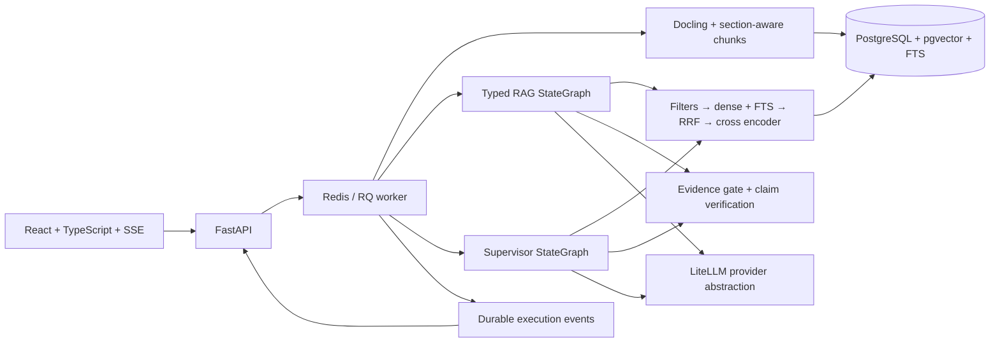
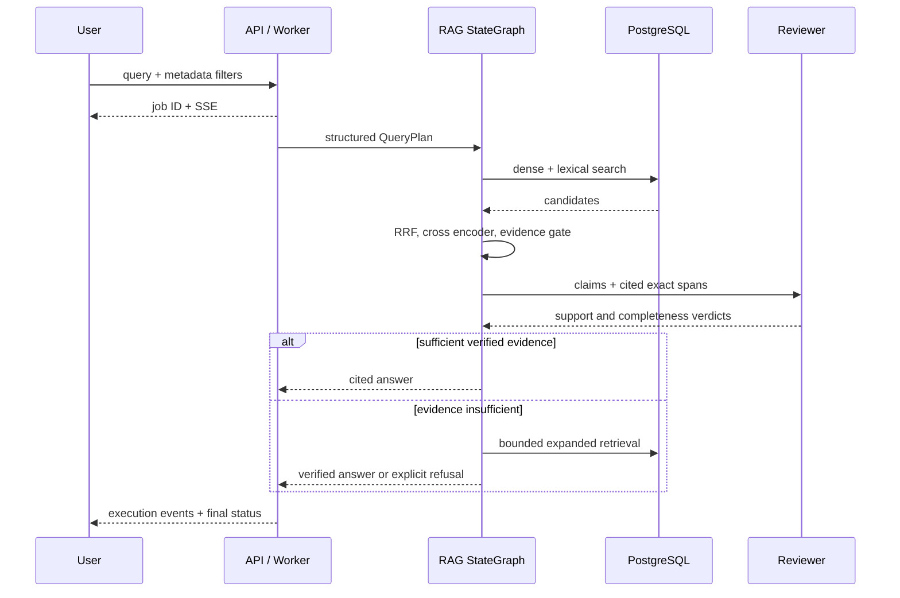
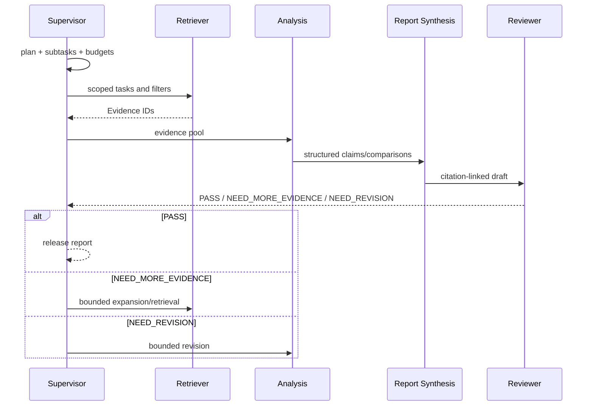

# Scientific RAGAgent

A local, evidence-grounded scientific literature knowledge base, RAG workflow and
Supervisor research system. MIT licensed; paper and model-weight licenses remain
independent. No langgraph-supervisor dependency. No fabricated benchmark claims.

The full implementation is on the `phase-6-evaluation-deployment` review branch
until staged PRs are reviewed. PRs are intentionally not auto-merged.

```bash
git clone --branch phase-6-evaluation-deployment https://github.com/chouytong/RAGAgent.git
cd RAGAgent
cp .env.example .env
docker compose up --build
```

Open [research assistant](http://localhost:8080) and [API docs](http://localhost:8000/docs).
Requires Docker Compose v2, Git, recommended 8 GB RAM and 20 GB free disk.
The system starts without API keys; inference requires configured chat providers
or local models. Local parsing/embedding/reranker weights download on first use.
`/api/health` reports process liveness; `/api/ready` checks DB, Redis and a queue
worker, without asserting model/provider inference readiness.

## Architecture



Python 3.11+, Pydantic v2, SQLAlchemy 2, Alembic, current LangGraph, LiteLLM,
Docling, PostgreSQL/pgvector, Redis/RQ; React/TypeScript/Vite; uv/npm locks,
Docker Compose, pytest/Ruff/mypy and GitHub Actions.

## Paper ingestion and knowledge base

Upload PDFs with optional title/authors/year/venue or import an open arXiv ID.
The original PDF, structured sections, text/tables/captions, pages, chunks and
embeddings are retained. Inspect indexing status and metadata in Knowledge Base.
Chunking stays within section and element type, with configurable token target
and overlap. Dense/lexical retrieval share all metadata predicates. Annotate
chunk entities for dataset/method/metric filters through the API.

```bash
curl -F 'file=@paper.pdf' -F 'title=Paper title' -F 'authors=Alice;Bob' \
  http://localhost:8000/api/papers/upload
curl -H 'Content-Type: application/json' -d '{"arxiv_id":"2408.09869"}' \
  http://localhost:8000/api/papers/arxiv
```

## RAG and research

RAG handles fact queries, method comparison and constrained retrieval. Every
released factual claim has validated structured Evidence IDs, exact supporting
text, paper, section, page and chunk. Model-authored citation markers are rejected;
only deterministic formatting emits citations. The configured rerank threshold
restricts the evidence supplied to generation and verification in both workflows.
Missing support triggers bounded expansion then explicit refusal.
Retrieval scores are heuristics, not calibrated model confidence probabilities.



Research generates a structured plan/subtasks, invokes Retriever and Analysis,
then deterministic Report Synthesis and Reviewer. NEED_MORE_EVIDENCE returns to
retrieval; NEED_REVISION returns to analysis. Retrieval, revision and total
iteration budgets prevent infinite loops. Drafts remain clearly labeled.
Retries retain a bounded union of accepted evidence. Replanned tasks retain
completion only if their full task content is unchanged, even when IDs are reused.



```bash
curl -H 'Content-Type: application/json' \
  -d '{"query":"How do the papers compare training methods?","filters":{"year_start":2023}}' \
  http://localhost:8000/api/rag/query
curl -H 'Content-Type: application/json' \
  -d '{"research_question":"Compare methods, datasets and metrics for scientific retrieval."}' \
  http://localhost:8000/api/research
curl -N http://localhost:8000/api/research/RUN_ID/events
```

## Providers and local models

Edit `.env` runtime secrets and `config/agents.yaml`, or nonsecret Settings UI
mapping. Each agent can independently use OpenAI, Anthropic, DeepSeek, Ollama or
an OpenAI-compatible local server through LiteLLM. Embeddings/reranker have
separate configuration. Provider connectivity tests never return keys.
Hosted embeddings support `openai`, `cohere`, `cohere_chat` and `voyage` prefixes;
compatible servers use `openai/<model>` with an explicit base. Embedding endpoint
identity is frozen for both indexing and SDK calls. A hosted
`EMBEDDING_REVISION` is an operator index label, not server-weight pinning.
See [deployment](docs/deployment.md) for all-local/hosted embedding examples,
model caches, migrations, network requirements and troubleshooting.

## Evaluation and development

Evaluation page accepts a benchmark dataset and runs retrieval ablation. APIs
also run RAG and multi-agent evaluation. Each run writes results.json/results.md
with Git commit, dataset hash, timestamp, execution configuration and actual
per-query metrics/latency. Generation results also retain the final output,
evidence and raw judge response for inspection. Semantic judge results are
explicitly MODEL_BASED; unknown provider charges make total cost incomplete.

```bash
python scripts/annotation_template.py my-annotations.json --count 100
uv sync
uv run ruff format . && uv run ruff check . && uv run mypy src
uv run pytest -q
npm --prefix frontend ci
npm --prefix frontend run lint
npm --prefix frontend run check
npm --prefix frontend run build
npm --prefix frontend exec -- playwright install chromium
npm --prefix frontend run test:e2e
```

There are **no 100 human-labeled examples** in this repository. The unannotated
100-row template must be filled by humans. Optional synthetic corpus/data are
**DEMO ONLY / NOT A BENCHMARK / NOT MANUALLY ANNOTATED**. No improvement number
is claimed. See [evaluation](docs/evaluation.md) for definitions and limitations.
Core tests require no paid API/model downloads; PostgreSQL/pgvector integration
runs in CI. `scripts/smoke.py` tests a fresh empty Compose deployment through
the frontend proxy, including a real missing-key worker failure and terminal
SSE; it does not test successful inference. [Stage log](docs/stage-log.md) records
actual verification.

## Documentation and limits

[Implementation/acceptance baseline](docs/MASTER_SPEC.md) ·
[Repair decisions](docs/adr/README.md) ·
[Reference/license review](docs/reference-review.md) · [Architecture](docs/architecture.md) ·
[Data model](docs/data-model.md) · [Retrieval](docs/retrieval.md) ·
[Agents](docs/agents.md) · [API](docs/api.md) · [Deployment](docs/deployment.md) ·
[Contributor rules](AGENTS.md).

V1 is a trusted local single-user application. English PostgreSQL FTS, exact
vector search and lexical token counts are deliberate first-release choices.
Docling equation/OCR/table fidelity depends on the document and models. Semantic
verification can be wrong; scientific conclusions need human review. Provider
capabilities, latency and model cost vary. Automatic checkpoint resumption,
public/multi-tenant security and ANN tuning require further work. Models and
PDFs are not vendored. Restricted cloud network/model access is reported as a
verification limitation, never disguised with mock inference.

The baseline and ADRs were written during the engineering repair; they are not
recovered historical specifications or prior acceptance evidence. The stage log
separates actual checks from real PDF/model/provider/benchmark validation that
remains unverified.
