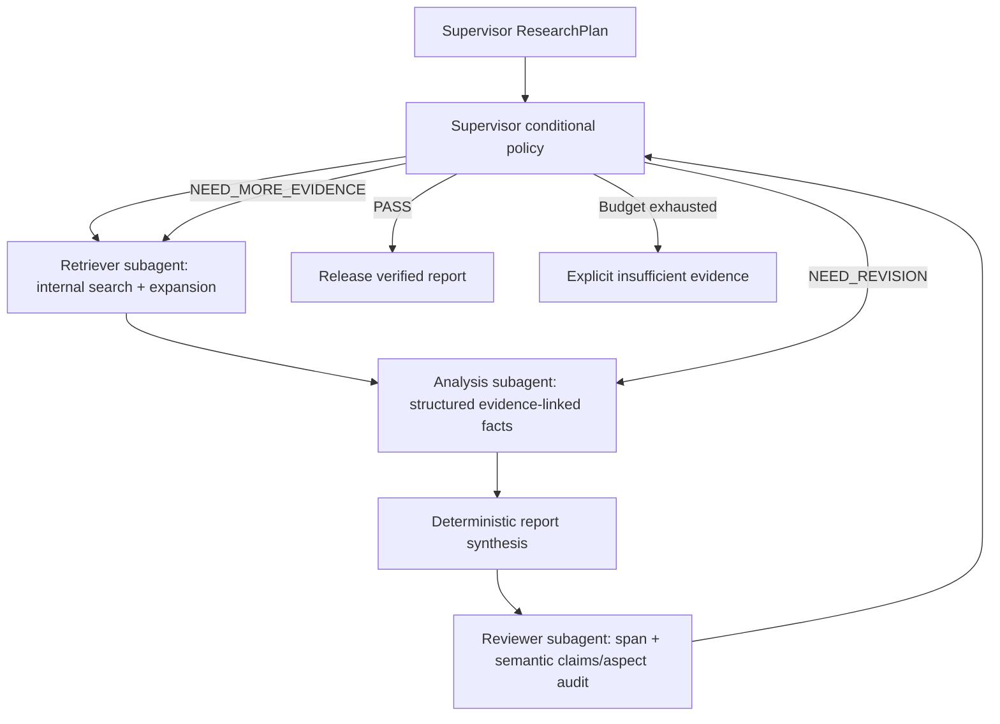

# Agents and bounded execution

RAG uses Pydantic RAGState and typed RAGUpdate; research uses MultiAgentState
and typed ResearchUpdate. The runtime is current LangGraph 1.2.12, with no
langgraph-supervisor dependency. Chat mappings are independently configured.

Supervisor produces bounded, structured subtasks and controls current/completed
tasks and routing. Retriever is invoked through a scoped search port; on retry
it uses the configured retriever model for expansion. Analysis returns linked
claims and structured comparisons/contradictions. Report synthesis adds no
LLM-generated prose. Reviewer verifies existence, spans, semantic support and
required aspect coverage; it cannot pass an unsupported claim by assessing style.
Unsupported or conflicting claim/evidence pairs force revision; supported contradictory findings can be reported with both citations. User metadata restrictions override planner
proposals and survive expansion. Evidence is unioned/deduplicated across retries
only after exact-span and configured rerank-threshold acceptance. Both graphs
use that accepted pool for generation and verification. `RAG_EVIDENCE_BUDGET`
defaults to 48 records and `RESEARCH_EVIDENCE_BUDGET` to 96, preserving earlier accepted records
first; reaching a pool limit is recorded as `evidence_budget_exhausted`.

Supervisor replans missing aspects from reviewer feedback while retaining prior
required aspects. A completed task survives replan only when its full validated
task content is unchanged; reusing an ID for different queries, filters or
aspects makes the task pending. Each replan, retrieval round and analysis/review
iteration advances counters. Explicit
retrieval/revision/iteration limits stop retries; runtime recursion_limit is an
additional guard. Research counts rounds separately from total retrieval queries.
Task completion means retrieval found task evidence; report completion additionally
requires every plan aspect to have supported claims. Report is only final on
PASS. Drafts remain inspectable through events but are labeled drafts.

RAG: plan → retrieve → evidence gate → answer claims → citation verifier.
Partial/insufficient evidence expands the query up to max retries, then refuses.
Query expansion deduplicates and retains at most six queries per plan/task;
the bounded evidence union preserves support from prior rounds even if earlier
queries leave that window. Model-authored citation markers in claim text fail
verification; deterministic rendering appends only validated Evidence IDs.
Unknown, missing or duplicate semantic verifier verdicts fail closed.

Model-based semantic verification remains fallible. This is an engineering
control, not a guarantee of scientific correctness or human ground truth.
