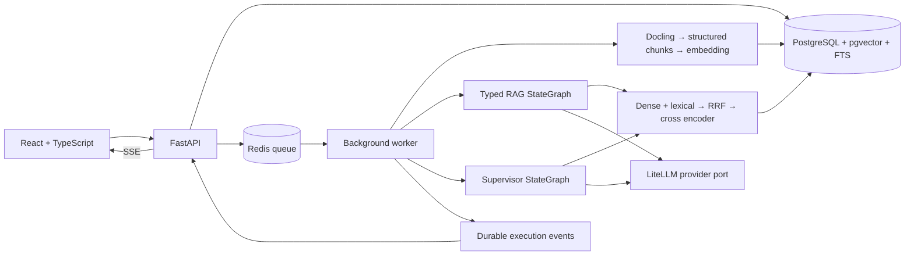

# Architecture

Two applications share ingestion, normalized PostgreSQL provenance, filtered hybrid retrieval and provider ports. Dependencies point inward to typed domain contracts.

Production defaults use local sentence-transformer embeddings and cross encoder,
Docling and a configurable chat mapping. Models download at first use and can
be pre-cached for offline operation. No mock provider is silently used when a
real provider fails. The empty database is a valid startup state; it must refuse
questions that have no evidence.

Paper ingestion commits parsed sections, chunks and embeddings atomically.
The uploaded original PDF and structured parse JSON are retained on a named
volume. Paper hashes deduplicate ingestion. Embedding fingerprints prevent
mixing vectors generated with different models.

Evidence sufficiency and citation validation occur before output. Semantic
verification is a model-based check, not human ground truth. Verification
failures trigger bounded retrieval/revision or explicit refusal.

The v1 deployment is a trusted, single-user local service bound to loopback.
Internet/multi-tenant exposure requires authentication, authorization,
quotas and transport security before deployment. DB and Redis are not exposed
by Compose. Arbitrary remote URLs are not accepted; arXiv IDs are validated.

## Stage acceptance

1. Research: reference/license review, architecture, engineering boundaries.
2. Data: migration round trip, structure/page-preserving chunks, parser fixtures, idempotent ingestion.
3. Retrieval: real pgvector/FTS queries, all filters, RRF ablation, providers, citation/evidence checks.
4. Graphs: current StateGraph execution with mocks, typed states, bounded retry/revision and refusal tests.
5. API/UI: queued jobs, durable SSE replay, all requested routes, TypeScript/build checks.
6. Evaluation/deployment: metrics computed from actual runs, dataset provenance, Compose startup, CI and documentation.
