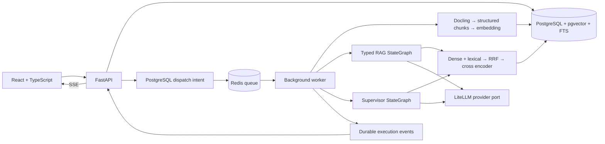

# Architecture

Two applications share ingestion, normalized PostgreSQL provenance, filtered hybrid retrieval and provider ports. Dependencies point inward to typed domain contracts.

Production defaults use local sentence-transformer embeddings and cross encoder,
Docling and a configurable chat mapping. Models download at first use and can
be pre-cached for offline operation. No mock provider is silently used when a
real provider fails. The empty database is a valid startup state; with configured providers it refuses questions that have no evidence. Missing provider credentials return an explicit configuration error.

Paper ingestion commits parsed sections, chunks and embeddings atomically.
The uploaded original PDF and structured parse JSON are retained on a named
volume. Paper hashes deduplicate ingestion. Embedding fingerprints prevent
mixing vectors generated with different models.
Concurrent duplicate uploads share one Paper/Run, and new paper/author/run/
dispatch records commit together. Metadata changes and ingestion retry lock the
paper so they cannot overwrite an in-progress state using stale reads.

Section identity is structural; headings and rendered paths remain display
labels. Parser node ancestry is carried into chunks and persisted independently
of separators or repeated headings. Existing legacy rows preserve their links;
lost pre-repair hierarchy requires reingestion rather than guessed migration.

Each queued Run commits durable dispatch intent in the same transaction.
Idempotent dispatch and transport-state reconciliation close the database/Redis
crash window. Ordinary failures and abnormal RQ subprocess exits persist safe
failure state. This repairs dispatch/status reliability, not automatic graph
checkpoint recovery. Terminal Run state and its final event commit together;
SSE reads terminal state before draining its event watermark and emitting `done`.

Evidence sufficiency and citation validation occur before output. Semantic
verification is a model-based check, not human ground truth. Verification
failures trigger bounded retrieval/revision or explicit refusal.
Generation, verification and release use the same threshold-accepted, exact-span
evidence pool. Claims supply structured Evidence IDs; model-authored citation
markers cannot bypass deterministic rendering. Retry evidence and query pools
are bounded, and changed research tasks do not inherit completion by ID alone.

Evaluation freezes the actual instantiated provider/search configuration and
retains output, evidence and raw model-based judgment. Corpus start/end hashes
detect boundary changes; they do not lock the corpus during a long run. Numeric
cost totals are absent when any attempted call's charge is unknown.
An allowlisted source hash distinguishes uncommitted implementation changes
from the recorded Git commit without including dotenv secrets or corpus files.

Infrastructure readiness checks PostgreSQL, Redis and the research queue's
registered worker; process liveness remains separate. The empty-corpus Compose
smoke exercises real RQ failure and proxied SSE with an unconfigured hosted
provider. Neither readiness nor that failure smoke proves successful inference.

The v1 deployment is a trusted, single-user local service bound to loopback.
Internet/multi-tenant exposure requires authentication, authorization,
quotas and transport security before deployment. DB and Redis are not exposed
by Compose. Arbitrary remote URLs are not accepted; arXiv IDs are validated.

## Stage acceptance

These are stage goals, not a declaration that every runtime capability passed.
The [reconstructed baseline](MASTER_SPEC.md) defines individual acceptance
requirements, [repair ADRs](adr/README.md) document current decisions, and
[stage-log.md](stage-log.md) records actual check outcomes and limitations.

1. Research: reference/license review, architecture, engineering boundaries.
2. Data: migration round trip, structure/page-preserving chunks, parser fixtures, idempotent ingestion.
3. Retrieval: real pgvector/FTS queries, all filters, RRF ablation, providers, citation/evidence checks.
4. Graphs: current StateGraph execution with mocks, typed states, bounded retry/revision and refusal tests.
5. API/UI: queued jobs, durable SSE replay, all requested routes, TypeScript/build checks.
6. Evaluation/deployment: metrics computed from actual runs, dataset provenance, Compose startup, CI and documentation.
