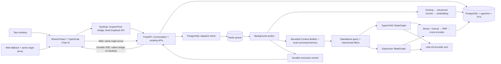

# Architecture

The desktop and Web applications share one React UI and local FastAPI service.
Conversation coordination sits above the existing independent RAG and research
graphs; ingestion, PostgreSQL provenance, filtered hybrid retrieval and provider
ports retain their existing boundaries. Dependencies point inward to typed domain
contracts.

The diagram shows shared application boundaries, not a second desktop task
system. The desktop renderer calls scoped IPC commands; Rust sends allowlisted
requests only to `http://127.0.0.1:8000`, with proxy routing and redirects disabled.
Web mode retains same-origin fetch/EventSource through nginx or Vite. The shell
does not run migrations, start Compose, or bundle Python/PostgreSQL/Redis. Host
and browser Origin validation in FastAPI remain enabled.

## Conversation lifecycle and trust boundary

PostgreSQL stores Conversation, ordered Message, ConversationSummary and explicit
Memory records. A submitted turn locks its conversation and atomically commits
the user message, an empty queued assistant message, the existing Run and dispatch
intent. A client request UUID deduplicates retransmissions; a changed payload with
the same UUID is rejected. A partial unique index permits one active Run per
conversation. Different conversations can queue independently on the existing RQ
worker architecture.

The worker loads prior eligible completed/refusal messages, local summary and
memories, builds a bounded contextualization request and invokes the configured
retriever model only when context needs processing. It records original and
contextualized queries plus context version, source IDs, budgets and truncation.
Structured constraint filters intersect this turn's filters before planning.
Unresolved references, invalid rewrite provenance or conflicting scopes fail with
explicit safe codes. The resulting standalone query and filters enter the selected
graph; full history, summary and memory do not enter analyst/reviewer evidence
payloads.

**Memory ≠ Evidence.** Referents and intentions may originate in conversation;
scientific claims must originate in the current retrieval and pass the existing
exact-span gate and claim/evidence validation. The Context Builder never constructs
EvidenceRecord objects or inserts conversation text into the paper index. Historical
assistant answers and multi-agent drafts are not evidence for another turn.

Older messages become a deterministic, lossy rolling extractive summary with
message-source IDs. This avoids another summarization LLM charge and does not
invent semantic facts. The input budget counts UTF-8 bytes conservatively as token
units, including contextualizer instruction/schema and a wrapper reserve; it is
not an actual provider tokenizer, total graph prompt budget or completion budget.
The original history remains stored until deletion. See
[conversation-memory.md](conversation-memory.md) for configuration and limitations.

Assistant content/status, terminal Run status and the final execution event commit
together. Failed/cancelled Runs produce explicit message states; intermediate drafts
remain in collapsed execution details. Retry creates a new assistant message/Run
while retaining the original failed attempt. Durable SSE replay and reloading
database messages restore an interrupted UI without treating an incomplete response
as final. Cancellation revokes the worker's right to publish before a best-effort
RQ stop; outstanding model requests may still incur charges.

Clear/delete cascades are defined explicitly: clearing memory deletes summary and
structured memory, while keeping history; clearing a conversation removes its
messages, Runs, dispatches, events and memory while retaining the empty conversation;
deleting removes that conversation as well. Clear and memory writes require idle
state. Full deletion may occur during execution; late workers fail closed rather
than recreate deleted messages. Knowledge-base data and unrelated Runs remain.

## Local persistence and inference

Default Compose binds API/frontend to loopback and keeps PostgreSQL/Redis private
to its local network. PDFs/parse files, vector index, conversation/history/memory
and execution records persist in local named volumes. Tauri does not introduce a
cloud database or memory service. Desktop-opened PDFs/evaluation files can create
additional private app-cache copies; exported files/backups are independent.

Choosing a remote chat/embedding/judge provider sends necessary context or source
excerpts to that service. Local storage alone does not establish local inference
privacy. An all-local setup requires local resources for each inference adapter,
including contextualization. Credentials are runtime-only and are not conversation
fields; recognizable credentials in user context are rejected without reading
runtime secrets. This is not a complete detector for arbitrary pasted secrets.

Production defaults use local sentence-transformer embeddings and cross encoder,
Docling and a configurable chat mapping. Models download at first use and can
be pre-cached for offline operation. No mock provider is silently used when a
real provider fails. The empty database is a valid startup state; with configured providers it refuses questions that have no evidence. Missing provider credentials return an explicit configuration error.

Paper ingestion commits parsed sections, chunks and embeddings atomically.
The uploaded original PDF and structured parse JSON are retained on a named
volume. Paper hashes deduplicate ingestion. Embedding fingerprints prevent
mixing vectors generated with different models.
Concurrent duplicate uploads share one Paper/Run, and new paper/author/run/
dispatch records commit together. Metadata changes and ingestion retry lock the
paper so they cannot overwrite an in-progress state using stale reads.

Section identity is structural; headings and rendered paths remain display
labels. Parser node ancestry is carried into chunks and persisted independently
of separators or repeated headings. Existing legacy rows preserve their links;
lost pre-repair hierarchy requires reingestion rather than guessed migration.

Each queued Run commits durable dispatch intent in the same transaction.
Idempotent dispatch and transport-state reconciliation close the database/Redis
crash window. Ordinary failures and abnormal RQ subprocess exits persist safe
failure state. This repairs dispatch/status reliability, not automatic graph
checkpoint recovery. Terminal Run state and its final event commit together;
SSE reads terminal state before draining its event watermark and emitting `done`.

Evidence sufficiency and citation validation occur before output. Semantic
verification is a model-based check, not human ground truth. Verification
failures trigger bounded retrieval/revision or explicit refusal.
Generation, verification and release use the same threshold-accepted, exact-span
evidence pool. Claims supply structured Evidence IDs; model-authored citation
markers cannot bypass deterministic rendering. Retry evidence and query pools
are bounded, and changed research tasks do not inherit completion by ID alone.

Evaluation freezes the actual instantiated provider/search configuration and
retains output, evidence and raw model-based judgment. Corpus start/end hashes
detect boundary changes; they do not lock the corpus during a long run. Numeric
cost totals are absent when any attempted call's charge is unknown.
An allowlisted source hash distinguishes uncommitted implementation changes
from the recorded Git commit without including dotenv secrets or corpus files.

Infrastructure readiness checks PostgreSQL, Redis and the research queue's
registered worker; process liveness remains separate. The empty-corpus Compose
smoke exercises real RQ failure and proxied SSE with an unconfigured hosted
provider. Neither readiness nor that failure smoke proves successful inference.

The v1 deployment is a trusted, single-user local service bound to loopback.
Internet/multi-tenant exposure requires authentication, authorization,
quotas and transport security before deployment. DB and Redis are not exposed
by Compose. Arbitrary remote URLs are not accepted; arXiv IDs are validated.

## Stage acceptance

These are stage goals, not a declaration that every runtime capability passed.
The [reconstructed baseline](MASTER_SPEC.md) defines individual acceptance
requirements, [repair ADRs](adr/README.md) document current decisions, and
[stage-log.md](stage-log.md) records actual check outcomes and limitations.

1. Research: reference/license review, architecture, engineering boundaries.
2. Data: migration round trip, structure/page-preserving chunks, parser fixtures, idempotent ingestion.
3. Retrieval: real pgvector/FTS queries, all filters, RRF ablation, providers, citation/evidence checks.
4. Graphs: current StateGraph execution with mocks, typed states, bounded retry/revision and refusal tests.
5. API/UI: queued jobs, durable SSE replay, all requested routes, TypeScript/build checks.
6. Evaluation/deployment: metrics computed from actual runs, dataset provenance, Compose startup, CI and documentation.
7. Conversation product upgrade: existing-database migration, idempotent turns,
   bounded follow-up context, memory isolation/deletion, chat UI persistence,
   conversational evaluation and separate desktop/Web transport verification.
