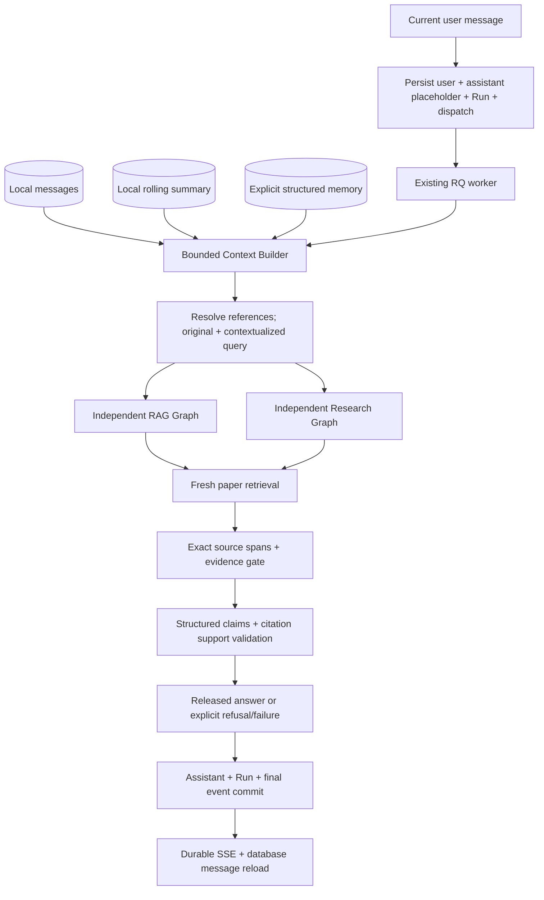

# Conversation and local memory

Conversation coordinates context and lifecycle above the existing RAG and Research
graphs. It does not replace Run, Redis/RQ, durable execution events or the scientific
evidence pipeline. The same API supports the Web UI and independent Tauri window.



## History, short-term context and structured memory

History is the complete ordered set of local Message records. It is retained for
reading/restoring the conversation, rather than permanently appended to each model
request. Only eligible completed/refusal user/assistant messages preceding the
current user are contextualization inputs. Internal system messages, pending
answers, failed assistant messages and intermediate agent drafts are excluded.

Short-term context combines recent eligible messages, the current query and a
rolling summary. Structured memory is a separate explicit record with one of
`goal`, `constraint`, `term`, `preference`, `task`, optional key and content.
Users add memories through the conversation Memory panel/API; no hidden profile
is extracted, no global cross-conversation memory is inferred, and no SaaS memory
service is used. Both layers live in the existing local PostgreSQL database.

Only `constraint` memory accepts a structured MetadataFilter. Its filters intersect
the current turn's scope before graph planning: years tighten bounds, allowed
IDs/names intersect, and compatible section paths retain the narrower scope.
Disjoint restrictions return `context_filters_conflict`. Ordinary natural-language
memory such as “prefer newer papers” can guide query intent but does not itself
guarantee a hard SQL restriction. For “only papers from 2023 onward”, save a
constraint with `filters.year_start=2023`.

```json
{
  "kind": "constraint",
  "key": "publication_scope",
  "content": "Compare only papers published from 2023 onward.",
  "filters": {"year_start": 2023}
}
```

There are at most 100 explicit memories per conversation. Their content is local,
inspectable and individually deletable. All memory changes require an idle
conversation so a queued/running turn does not silently change its context scope.

## Bounded context and rolling summary

The Context Builder is an independently testable typed service. It builds the
current question, recent-message excerpts, rolling summary, explicit-memory
excerpts and enforced filters; it never creates EvidenceRecords. Defaults are:

| Setting | Default |
|---|---|
| `CONVERSATION_RECENT_MESSAGE_LIMIT` | 8 messages, not 8 turns |
| `CONVERSATION_CONTEXT_TOKEN_BUDGET` | 8192 approximate multilingual contextualization input tokens; valid range 4096–65536 |
| `CONVERSATION_SUMMARY_MAX_BYTES` | 2048 UTF-8 bytes |
| `CONVERSATION_MESSAGE_MAX_BYTES` | 2048 UTF-8 bytes per message/memory excerpt |

The estimate uses two tokens per CJK character, roughly one per three Latin/
alphanumeric characters and one per punctuation character. It counts serialized
payload, instruction, response schema and a 512-token wrapper reserve. This is
approximate, not a tokenizer upper bound. Existing UTF-8 byte caps still prevent
oversized excerpts. The provider adapter records actual returned usage/cost.
The current question and enforced filters are never silently clipped.

Subbudgets default to `CONVERSATION_RECENT_TOKENS=2048`,
`CONVERSATION_SUMMARY_TOKENS=1024`, `CONVERSATION_MEMORY_TOKENS=1024`;
`CONVERSATION_MEMORY_TOP_K=8`. Stored Memory contains up to 100 explicit records;
Selected Memory is a stable relevance/kind/ID-ranked text subset. English terms
and Chinese character bigrams supply deterministic relevance. Dependent questions
can retain term memories for pronoun resolution. **All structured hard filters
merge before text selection**, including constraints whose text is not selected.
This selector is bounded engineering behavior, not learned retrieval quality.

A deterministic bilingual gate skips contextualization for independent questions
(e.g. “DANN 是什么？”); pronoun, ordinal and prior-turn cues require resolution.
Ambiguity still fails closed. Heuristics cannot guarantee every natural-language
question is classified correctly; ambiguous questions should name their target.

`conversation_states` (migration `0006`) stores typed goals, constraints,
validated entities, explicit terms and the latest open question, each with source
IDs. It has no scientific-findings field and is marked `scientific_evidence=false`.
Validated old entity names can survive summary clipping only while their original
same-conversation Message/Memory exists and remains eligible. Superseded attempts
cannot anchor them. Memory mutation, summary deletion, memory clear and conversation
clear invalidate state; conversation deletion cascades it. The Memory panel and
`GET /api/conversations/{id}/state` expose it. This supplements the extractive
summary and does not turn either record into citation evidence.

Older messages are compacted into a deterministic, lossy extractive summary.
It keeps source message IDs, the initial question/answer anchors and recent
compressed excerpts within a byte limit. It uses whitespace compaction/clipping,
not another semantic summarization LLM. The summary explicitly says its excerpts
are unverified context. The database retains full messages while the summary
records its version, covered ordinal and source IDs.

If the initial recent window exceeds the budget, older recent messages join the
summary. Memory/summary text can be clipped further; structured filters and the
current query remain intact. Used/truncated source IDs and budget/configuration
metadata are recorded. A fixed instruction/schema or current question that cannot
fit returns `context_budget_exceeded`. A small valid settings value can therefore
be too small for a particular request.

Extractive clipping is deliberately simple and can lose entities, ordering or
necessary details in very long chats. It does not guarantee arbitrary long-history
semantic fidelity. The user should clarify references when resolution fails or
create an explicit term/constraint memory for stable context.

## Query contextualization and evidence isolation

The configured retriever chat adapter resolves the bounded context into a
standalone literature-search question, not an answer. It returns status, the
rewritten query, used message/memory IDs and source-linked entity referents.
The application validates the supplied source IDs, exact referent text, common
pronoun/ordinal replacement and introduced numbers/citation markers. Invalid
or explicitly ambiguous resolution fails rather than releasing an answer.
With no context, an already standalone question needs no extra rewrite call;
unresolved common references without a selected paper fail explicitly.

For example, after an answer naming Dataset A and Dataset B, “Which one has the
largest sample size?” should become a question comparing both named candidates.
The rewrite must not choose the winner from the previous answer. It then retrieves
current paper evidence for sample sizes and follows the normal gate, generation,
review and deterministic citation formatting path.

**Memory ≠ Evidence.** Conversation text may tell the system what “the second
dataset” refers to. It cannot tell the system that this dataset has 500 participants
as a verified scientific fact. History, summary and memory only go to the
contextualizer. The selected graph receives the standalone query and validated
filters; analyst/reviewer receive fresh evidence payloads from the paper index.
The Context Builder cannot issue Evidence IDs or populate the knowledge base.
Every released scientific claim still needs exact spans and supported claim/evidence
pairs from the current evidence pipeline.

Rewrite validation is an engineering control around a model-based interpretation,
not a guarantee of correct reference resolution or comprehensive prompt-injection
resistance. The evidence verifier is also model-based. Test failures must fail
closed; real-model conversational quality and adversarial robustness need separate
evaluation and human inspection.

Run requests keep the original submitted query/message associations. Run result
`conversation_context` and events `context_prepared`/`contextualize` expose the
original/contextualized queries, version/configuration, used source IDs, summary
coverage and input estimate. This makes a bad rewrite inspectable without placing
unverified context in the citations. Contextualization uses the retriever's usage
ledger, including hosted-call cost; no additional untracked provider is introduced.

## Lifecycle, retries and deletion

The send transaction creates both messages, Run and durable dispatch intent.
`client_request_id` is a UUID for one logical submission. Replaying it with an
identical request returns the same turn; a conflicting request returns 409.
Conversation row locks and a partial unique Run index permit one active turn per
conversation. Queue outages preserve accepted queued records for reconciliation.

The assistant placeholder follows its Run status. Only a released answer becomes
completed assistant content; insufficient evidence, failure and cancellation have
explicit states. Terminal message/Run/event writes share a transaction. SSE replays
durable events by cursor and database message reload restores content after a
browser/window restart. The UI never promotes streamed intermediate drafts to final
scientific answers. Markdown/code blocks and citation links remain readable while
Supervisor/Reviewer/trace data stay in collapsed details.

Retry is available for the latest failed/cancelled/insufficient assistant message.
It creates a new Run/assistant and preserves the original user and failure trail;
it is a newly billed attempt. Cancellation revokes worker publication before a
best-effort RQ stop, so a late response cannot overwrite the cancelled state.
It does not guarantee stopping an already sent provider request or avoiding its fee.

| Action | Deleted | Retained |
|---|---|---|
| Delete one memory | Selected Memory record | Other memory, summary, messages/Runs |
| Delete summary | ConversationSummary record | Memory and messages/Runs; summary may rebuild later |
| Clear Conversation Memory | All Memory and Summary records | Messages/Runs; recent history still contextualizes and can rebuild a summary |
| Clear Conversation | Messages, associated Runs/events/dispatches, summary, memory | Empty Conversation with reset automatic title; knowledge base |
| Delete Conversation | Same contents plus Conversation | Knowledge base and unrelated Runs/evaluations |

Clear and memory mutations require idle state. Full deletion can remove an active
conversation; deletion cascades through its Run records and a late worker cannot
recreate them. This is database-record deletion, not forensic erasure. Backups,
downloaded artifacts and desktop cache files are independent copies. Opening a
knowledge-base PDF can create an app-cache copy which requires separate cleanup;
deleting a chat never deletes its source paper or another conversation's citations.
Deleting a memory or summary also does not rewrite earlier assistant messages or
their stored contextualized queries. Use full conversation clear/delete to remove
those conversation records as well.

## Privacy, deployment and verification

Local PostgreSQL/filesystem persist PDFs, vectors, chats, summaries, memories and
execution records. This release introduces no cloud conversation database, SaaS
memory service or second SQLite store. Runtime API keys remain separate; recognizable
credentials in conversation fields are rejected, but users must not paste secrets
because an arbitrary credential may not match a detector.

Remote contextualizer/chat/embedding/judge services receive their necessary input
text. Local persistence is not a promise that all data remains on the machine.
Use local resources for every inference adapter for local inference, with weights
pre-cached if offline operation is required.

Tauri uses a fixed loopback Rust bridge; Web mode uses same-origin nginx/Vite.
The shell opens a window and checks the existing backend; it does not package or
launch PostgreSQL/Redis/Python. [Deployment](deployment.md) describes start/build
commands and platform prerequisites. [Evaluation](evaluation.md) describes four
conversational dimensions and model-based metrics. Actual test/GUI results and
unverified real-model scenarios belong in [stage-log](stage-log.md).
